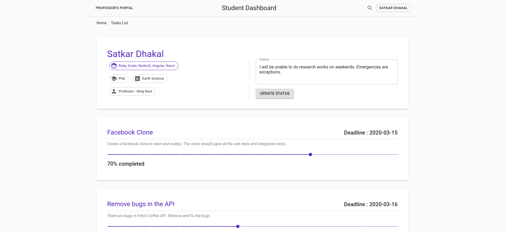
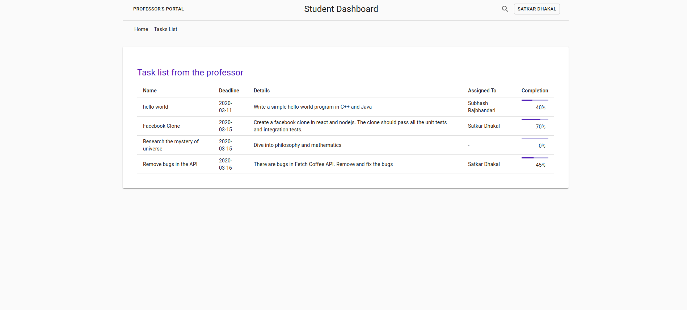
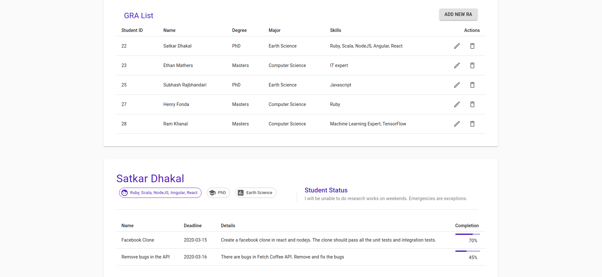
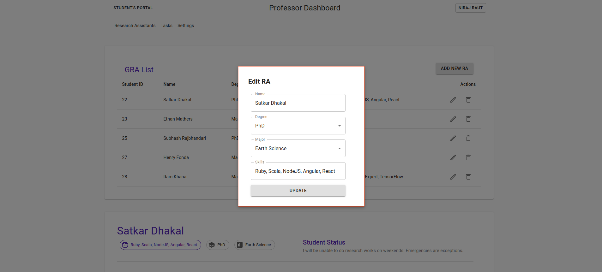
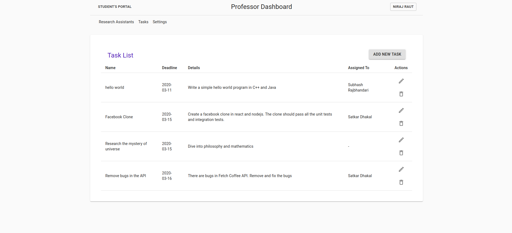

This project was made with [React](https://github.com/facebook/create-react-app), using the [Redux](https://redux.js.org/) and [Redux Toolkit](https://redux-toolkit.js.org/).

## Steps to run in your local machine

### `Run gra-api in localhost`
This app sends API requests for data exchange to localhost on port 4000.

In the project directory, you can run:
### `npm install`
Installs all the dependencies from package.json 

### `npm start`

Runs the app in the development mode. 
Open [http://localhost:3000](http://localhost:3000) to view it in the browser.

## Entry Points

Authorization,authentication and session handling was out of scope of the task requirements and are not implemented. 
* Base URL [http://localhost:3000](http://localhost:3000) redirects to professor dashboard access page which requests for professor ID. Professor can create a new account using [http://localhost:3000/professor/register](http://localhost:3000/professor/register). A unique ID is given upon registration and can be used to login through [http://localhost:3000/professor/login](http://localhost:3000/professor/login)

* Students can access the login page through [http://localhost:3000/student/login](http://localhost:3000/student/login). Students do not have the ability to create an account. To access the student's dashboard, the student has to enter the same ID that was automatically generated and assigned to the student through professor's dashboard.

## Database
The database configuration is not necessary. The MySQL database for the project is hosted remotely. 

The ER Diagram for the database is provided in the README.md  file of the API repo. 

## For Production (Optional)
### `npm run build`

Builds the app for production to the `build` folder. 
It correctly bundles React in production mode and optimizes the build for the best performance.

The build is minified and the filenames include the hashes. 
Your app is ready to be deployed!

See the section about [deployment](https://facebook.github.io/create-react-app/docs/deployment) for more information.

### `npm run eject`

**Note: this is a one-way operation. Once you `eject`, you can’t go back!**

If you aren’t satisfied with the build tool and configuration choices, you can `eject` at any time. This command will remove the single build dependency from your project.

Instead, it will copy all the configuration files and the transitive dependencies (Webpack, Babel, ESLint, etc) right into your project so you have full control over them. All of the commands except `eject` will still work, but they will point to the copied scripts so you can tweak them. At this point you’re on your own.

You don’t have to ever use `eject`. The curated feature set is suitable for small and middle deployments, and you shouldn’t feel obligated to use this feature. However we understand that this tool wouldn’t be useful if you couldn’t customize it when you are ready for it.

##Screenshots

